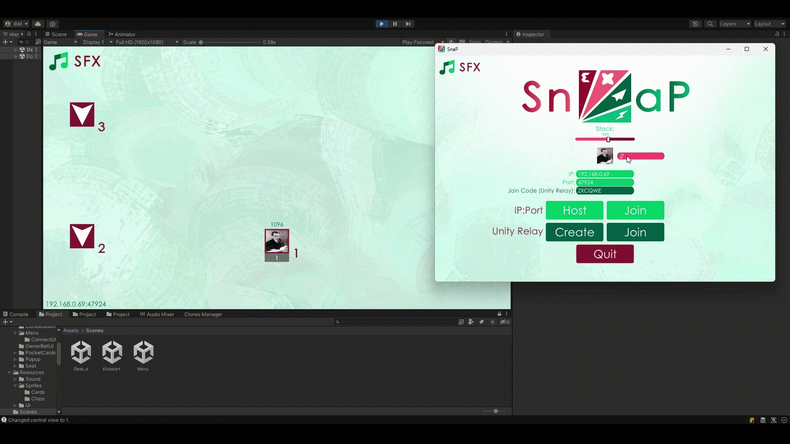

# **SnaP - Shurely not a Poker**

**"SnaP"** is a poker-based game with unique NSTU-like graphics.
The project branched off from original [PokerMultiplayer](https://github.com/Twinkllle/PokerMultiplayer/tree/main) Game and created for NSTU subject called *Project Activities*.
The [rules](https://en.wikipedia.org/wiki/Texas_hold_%27em#Rules) of **Texas Hold 'em** as one of the most popular poker card game variants was used.


<p align="center">
<b><i>Join sample</i></b>
</p>

## Want to just Play? Here you go!
To play you should visit GitHub [releases page](https://github.com/Twinkllle/PokerMultiplayer/releases) and download version for your OS. For nowadays we have only **Windows** and **Linux** standalone client and dedicated server support.

## Standalone Setup Guide 
### [LAN](https://en.wikipedia.org/wiki/Local_area_network) IP and Port connection:
By default the input fields will be autocomplete depending on your **Local IP address** and **Port** will be set to **47924**.

After setup of the connection data you will be allowed to start Hosting or Joining via **LAN** by clicking the *Host* or *Join* buttons next to the **IP:Port** text label.
### [WAN](https://en.wikipedia.org/wiki/Wide_area_network) IP and Port connection:
If you and your friends are not connected to the same **LAN** but still want to play together without resorting to services like **Hamachi** or **Radmin VPN** there is some solutions.
1. [**Unity Game Services:**](https://unity.com/solutions/gaming-services) To use it in SnaP game you should press *Create* button (that would be same as *Host* in LAN connection).
 After that you will start hosting at Unity Realy servers. At the **Desk** in the bottom-left corner you will able to see your 6-digits **Join Code** (e.g. *ZXCQWE*) then you can left-click it. 
 This will copy code to the clipboard so you can send it to your friends so they should paste it to *Join Code* input filed. Then press *Join* button next to **Unity Relay** text label.</br>
 

1. **Hosting with Port Forwarding:** First you have to forward a port (it can be default port *47924* or almost any other port you wish) in **Router/Firewall** settings (may be this [windows instruction](https://www.lifewire.com/how-to-port-forward-4163829) can be helpful).
	Next steps:
	* Start game as you do it for LAN. 
	* Get your [Public IP address](https://www.whatismyip.com/).
	* Your friends should paste it at *IP* and forwarded *Port* to input fields and click *Join* button.
## Dedicated server Setup Guide
1. As in 2nd paragraph of WAN [Standalone Setup Guide](#WAN) you have to forward a port.
2. When your port is forwarded you should start server.
* At Windows machine at `..\win_dedicated` run:
```bash
$ .\SnaP_Server.exe
```
* At Lunix machine run at `../linux_dedicated`  run:
```bash
$ sudo chmod +x ./SnaP_Server.x86_64
$ ./SnaP_Server.x86_64
```
If you forwarded different from *47924* port then you can add the `-port` argument when starting game.
```bash
$ ./SnaP_Server.x86_64 -port 12345
```

The terminal will notify about the successful start of the server:
```bash 
====== STARTING AT: <LOCAL_SERVER_IP:PORT> ======
Forwarding to public IP...
# ...Some...
# ...Unity...
# ...Logs here...
Successfully started at <PUBLIC_SERVER_IP:PORT>
```
Or about start failure:
```bash
====== STARTING AT: <LOCAL_SERVER_IP:PORT> ======
Failed to start at <LOCAL_SERVER_IP:PORT>. Attempt 1/4
Failed to start at <LOCAL_SERVER_IP:PORT>. Attempt 2/4
Failed to start at <LOCAL_SERVER_IP:PORT>. Attempt 3/4
Failed to start at <LOCAL_SERVER_IP:PORT>. Attempt 4/4
Connection timeout. Shuts-downing in 3000 milliseconds.
```

## **Requirements**:
 - Unity Version [**2021.3**](https://unity3d.com/get-unity/download) or newer
## **Services implemented:**
  * [Netcode for GameObjects](https://unity.com/products/netcode) 
    >This library is used to synchronize GameObject and game state data across all clients that connect in a networking session.
  * [UnityTransport](https://docs-multiplayer.unity3d.com/transport/current/about/index.html)
    >Unity Transport provides the `com.unity.transport` package, used to add multiplayer and network features to your project.
  * [Unity Gaming Services (Relay)](https://unity.com/solutions/gaming-services)
    >These services make it easy for players to host and join games that are playable over the internet, without the need for port forwarding or out-of-game coordination.
  * [ParrelSync](https://github.com/VeriorPies/ParrelSync)
	>ParrelSync is a Unity editor extension that allows users to test multiplayer gameplay without building the project by having another Unity editor window opened and mirror the changes from the original project.

## **Resources:**
* [Holdem Combination Сalculator](https://github.com/ccqi/TexasHoldem)
* [Standalone File Browser](https://github.com/gkngkc/UnityStandaloneFileBrowser)
* All Sprites and UI:
	* [VK](https://vk.com/id607494051)
	* [VK Public](https://vk.com/preved_medveddd)
## Feedback:
* Email: theactualtwinkle@gmail.com
* Telegram: https://t.me/TheActualTwinkle